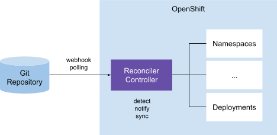
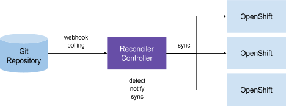
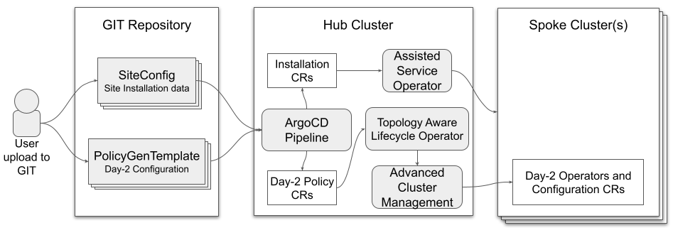

# Introduction to Zero Touch Provisioning (ZTP)

5G is not only about the speed as in bandwidth, but also as the latency, and one of the key areas being pursued this, is getting the network functions closest to the end-user. 
Nobody said that this could be simple, as it demands a lot of technology and instead of being datacenter-centric, the promises of higher speed and reduced latency, come with a cost: services should be closest to the customer to satisfy them. Therefore, telco edge computing presents extraordinary challenges with managing hundreds to tens of thousands of clusters in hundreds of thousands of locations. These challenges require fully-automated management solutions with, as closely as possible, zero human interaction.

Zero touch provisioning (ZTP) allows you to provision new edge sites with declarative configurations of bare-metal equipment at remote sites following a GitOps deployment set of practices. Template or overlay configurations install OpenShift Container Platform features that are required for CNF workloads. End-to-end functional test suites are used to verify CNF related features. All configurations are declarative in nature.

ZTP is a project to deploy and deliver OpenShift 4 in a hub-and-spoke architecture (in a relation of 1-N), where a single hub cluster manages many spoke clusters. The hub and the spokes will be based on OpenShift 4 but with the difference that the hub cluster will manage, deploy and control the lifecycle of the spokes using Red Hat Advanced Cluster Management (RHACM). So, hub clusters running RHACM apply radio access network (RAN) policies from predefined custom resources (CRs) and provision and deploy the spoke clusters using ZTP and Assisted Installer (AI). [link to ZTP components]()

> :exclamation: ZTP, of course, can have two scenarios, connected and disconnected, wether the OpenShift Container Platform Worker nodes can directly access the internet or not. In our lab and for telco deployments, disconnected scenario is the most common.

ZTP provides support for deploying single node clusters, three-node clusters, and standard OpenShift clusters. This includes the installation of OpenShift and deployment of the distributed units (DUs) at scale. In this lab, we will focus on SNO clusters which was a topic discussed in [Introduction to Single Node OpenShift (SNO)](./2.md)

## GitOps

ZTP uses the GitOps deployment set of practices for infrastructure deployment that allows developers to perform tasks that would otherwise fall under the purview of IT operations. GitOps rely on Git pull requests to manage infrastructure and application configurations. Git repository in GitOps is considered the only source of truth and contains the entire state of the system so that the trail of changes to the system state are visible and auditable.

Traceability of changes in GitOps is no novelty in itself as this approach is almost universally employed for the application source code. However GitOps advocates applying the same principles (reviews, pull requests, tagging, etc) to infrastructure and application configuration so that teams can benefit from the same assurance as they do for the application source code.

Although there is no precise definition or agreed upon set of rules, the following principles are an approximation of what constitutes a GitOps practice:

* Declarative description of the system is stored in Git (configs, monitoring, etc)
* Changes to the state are made via pull requests
* Git push reconciled with the state of the running system with the state in the Git repository

### GitOps Principles

GitOps paradigm requires us to describe and observe systems with **declarative** specifications that eventually form the basis of continuous everything. (As a refresher, continuous everything includes but is not limited to continuous integration (CI), testing, delivery, deployment, analytics, governance with many more to come). In turn, in an imperative paradigm, the user is responsible for defining exact steps which are necessary to achieve the end goal and carefully plan every step and the sequence in which they are executed. 

GitOps achieves these tasks using declarative specifications stored in Git repositories, such as YAML files and other defined patterns, that provide a framework for deploying the infrastructure. The declarative output is leveraged by the Red Hat Advanced Cluster Management (RHACM) for multisite deployment.

> :exclamation:  Red Hat OpenShift is a declarative Kubernetes platform that administrators can configure and manage using GitOps principles. Furthermore, Red Hat collaborates with open source projects like ArgoCD and Tekton to implement a framework for GitOps.

One of the motivators for a GitOps approach is the requirement for **reliability at scale**. This is a significant challenge that GitOps helps solve. GitOps addresses the reliability issue by providing traceability, RBAC, and a single source of truth for the desired state of each site. Every change throughout the application life cycle is traced in the Git repository and is auditable. Making changes via Git means developers can finally do what they want: code at their own pace without waiting on resources to be assigned or approved by operations teams. **Scale** issues are addressed by GitOps providing structure, tooling, and event driven operations through webhooks.

Below, the list of the basic principles on which GitOps stands:

* **The definition of our systems is described as code**. The configuration for our systems can be treated as code, so we can store it and have it automatically versioned in Git, our single source of truth. That way we can rollout and rollback changes in our systems in an easy way.

* **The desired system state and configuration is defined and versioned in Git**. Having the desired configuration of our systems stored and versioned in Git give us the ability to rollout / rollback changes easily to our systems and applications. On top of that we can leverage Git's security mechanisms in order to ensure the ownership and provence of the code.

* **Changes to the configuration can be automatically applied using pull request (PR) mechanisms**. Using Git Pull Requests we can manage in an easy way how changes are applied to the stored configuration, you can request reviews from different team members, run CI tests, etc. On top of that you don't need to share your cluster credentials with anyone, the person committing the change only needs access to the Git repository where the configuration is stored.

* **There is a controller that ensures no configuration drifts are present**. As the desired system state is present in Git, we only need a software that makes sure the current system state matches the desired system state. In case the states differ this software should be able to self-heal or notify the drift based on its configuration.

### GitOps Patterns on OpenShift

By using the same Git-based workflows that developers are familiar with, GitOps expands upon existing processes from application development to deployment, application life cycle management, and infrastructure configuration.  For ops teams, visibility to change means the ability to trace and reproduce issues quickly, improving overall security. 

**On-Cluster Resource Reconciler**

In this pattern, a controller on the cluster is responsible for comparing the Kubernetes resources (YAML files) in the Git repository that acts as the single source of truth, with the resources on the cluster. When a discrepancy is detected, the controller would send out notifications and possibly take action to reconcile the resources on Kubernetes with the ones in the Git repository. Weaveworks Flux use this pattern in their GitOps implementation.

**External Resource Reconciler (Push)**

A variation of the previous pattern is that one or a number of controllers are responsible for keeping resources in sync between pairs of Git repositories and Kubernetes clusters. The difference with the previous pattern is that the controllers are not necessarily running any of the managed clusters. The Git-k8s cluster pairs are often defined as a CRD which configures the controllers on how the sync should take place. The controllers in this pattern would compare the Git repository defined in the CRD with the resources on the Kubernetes cluster that is also defined in the CRD and takes action based on the result of the comparison. OpenShift GitOps based on ArgoCD is one of the solutions that uses this pattern for GitOps implementation.

### Direct commit to main
TBD
### Pull Requests and review cycles
TBD
### Directories vs branches
TBD

## ZTP workflow

As mentioned, Red Hat Advanced Cluster Management (RHACM) leverages zero touch provisioning (ZTP) to deploy OpenShift Container Platform clusters using a GitOps approach. While the workflow starts when the site is connected to the network and ends with the CNF workload deployed and running on the site nodes, it can be logically divided into two different stages: provisioning of the SNO and applying the desired configuration, which in our case is applying the validated RAN DU profile.

> :warning: The workflow does not need any intervention, so ZTP automatically will configure the SNO once it is provisioned. However, two stages are clearly differentiated.

You start the workflow by creating declarative configurations for the provisioning of your OpenShift clusters. This configuration is called `siteConfig` and it is understood by ZTP using an specific kustomize plugin called [siteconfig-generator](https://github.com/openshift-kni/cnf-features-deploy/tree/master/ztp/siteconfig-generator-kustomize-plugin). This CR contains all the necessary information for RHACM and Assisted Installer to provision your node or nodes. Basically, it will create ISO images that are delivered to the edge nodes to begin the installation process. The images are used to repeatedly provision large numbers of nodes efficiently and quickly, allowing you keep up with requirements from the field for far edge nodes. 

Once a cluster is provisioned, the day-2 configuration defined in multiple `PolicyGenTemplate` custom resources will be automatically applied. This configuration includes the installation of the common telco operators, common configuration for telco RAN and specific configuration for each site which is very dependant on the hardware such as SR-IOV or performance settings.

The deployment of the clusters includes:

* Installing the host operating system (RHCOS) on a blank server.
* Deploying OpenShift Container Platform.
* Creating cluster policies via `PolicyGenTemplate` and site subscriptions via `SiteConfig`
* Leveraging a GitOps deployment topology for a develop once, deploy anywhere model.
* Making the necessary network configurations to the server operating system.
* Deploying profile Operators and performing any needed software-related configuration, such as performance profile, PTP, and SR-IOV.
* Downloading images needed to run workloads (CNFs).