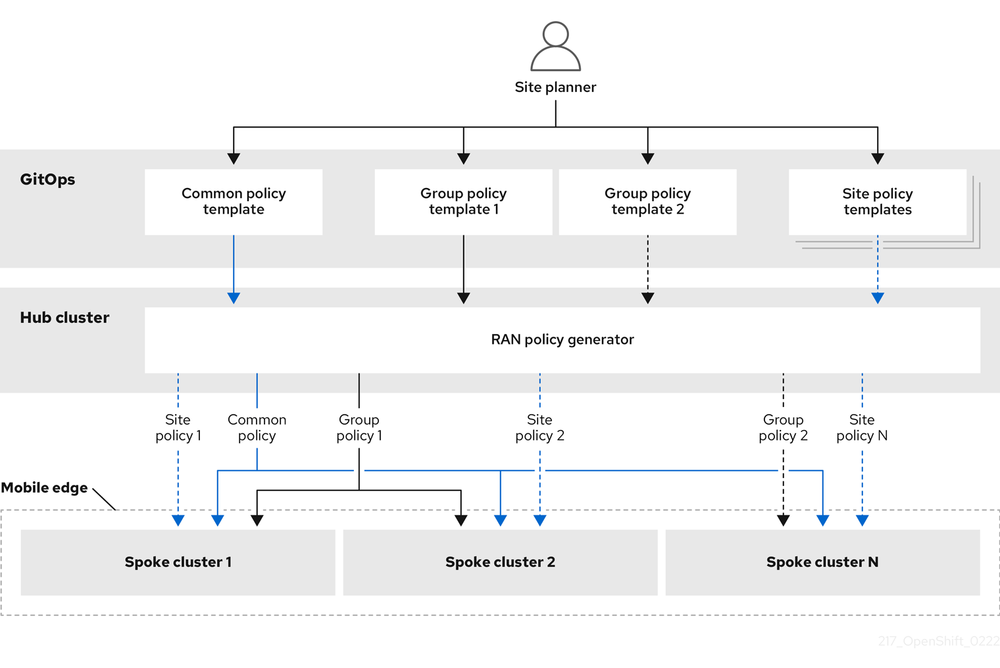

# Managing at Scale

In the previous section we described RHACM policies, in this section we are going to explain a bit more how we leverage some of their capabilities, plus other APIs to manage cluster configurations at scale.

## Inform Policies

In RHACM as we saw in the previous section we can configure our policies in two modes, _inform_ and _enforce_. 

When using _inform_ mode no changes will be done in the clusters targeted by the policy, whereas _enforce_ mode will make the required changes to clusters targeted by the policy have the required configuration described in the policy.

In RAN environments we want to have control over when changes to our clusters happen, and that's why all the policies will be configured with _inform_ mode. On top of these policies we have another component named TALM which controls when a policy gets enforced based on a configuration created by the cluster admins. TALM will be introduced in a future section.

## OLM Subscriptions

When installing operators in OpenShift we make use of OLM subscriptions. One of the configurations exposed by subscriptions is the update policy which can be either set to _manual_ or _automatic_.

As we explained earlier, in RAN environments we want to have control over when changes to our clusters happen, so all our subscriptions will have an update policy set to _manual_. Again, TALM will control when the operators are updated.

## Cluster Policies

In a future section we will introduce the concept of _PolicyGenTemplates_, but before we do that we will introduce the different types of Policies we can configure in our environments.

* **Common Policies**

    Policies that apply to all our clusters. Some examples of policies that can fit this group will be: OAuth configuration, logging configuration, etc.

* **Group Policies**

    Policies that apply to a group of clusters that share a common identifier/feature. Some examples of policies that can fit this group will be: SRI-OV deployment on clusters with SRI-OV cards, accelerator operator deployment on clusters with accelerator cards.

* **Site Specific Policies**

    Policies that apply to clusters within a site. Site can be whatever you want it to be; a physical location, an infrastructure provider, etc. Some examples of policies that can fit this group will be: storage configuration, proxy configurations.

* **Cluster Specific Policies**

    Policies that apply to a specific cluster. Some examples of policies that can fit this group will be: a performance profile configuration for a cluster, an SRI-OV configuration for a specific NIC in the cluster.

# Main takeaways of this section

---

[:arrow_backward: Back - RHACM Policies](./6.md)

[:arrow_forward: Next - ZTP at Scale](./8.md)